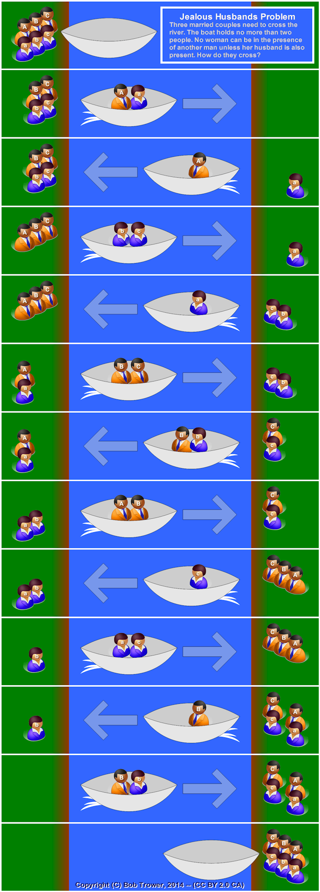

>### tl;dr
> * Representations are powerful problem-solving technique that provides perspective, and makes difficult problems easy
> * Like humans, AI benefits from problem constraints and making abstract problems concrete
> * We can make problems concrete using mental models. We make mental models by representing the problem

How you frame a problem is everything. It can make a painless problem painful. However, a good mental model will make even complex, abstract problems concrete and simple to solve.

The same is true in computer science and human-like AI. The rest of this article will use an example to illustrate mental models or **semantic nets** and why you should try to frame a problem in a way that *aids* rather than hinder its representation.

## An example problem: Wolves and Sheep
A fun brain teaser: the wolves and sheep problem (or its many variants, such as missionaries and cannibals) asks how to move the two groups across a river without losing any members. The boat can hold up to two members, and may not cross without at least one sheep or wolf in the boat. If wolves outnumber sheep on either bank, then the sheep are eaten, and the game is lost.

{: height="550" }

The graphic above is a great representation, but we can't use images as code usually, so let's make it even simpler!
Say $$A$$ represents the origin bank of the river and $$B$$ the goal bank, If we have one sheep and one wolf we can model it as:

>A < B
>1 	0
>1 	0

We can see that the boat is currently on bank $$A$$ because we have '<' point to the current bank. When we cross, we are left with:

>A > B
>0 	1
>0 	1

While this example is trivial, we have made the problem concrete enough to represent it using code. In Python, we can use a tuple, like ((B)ank, (s)heep,(w)olves). To make the model even simpler, we have sheep and wolves only count for the sheep and wolves on bank A of the river. We can deduce the number of sheep on bank B at any time (i.e., total sheep - bank A sheep = bank B sheep).
Now we can observe all possible states in the problem:

1. Send two wolves to the other bank
2. Send two sheep to the other bank
3. Send one wolf to the other bank
4. Send one sheep to the other bank
5. Send one wolf and one sheep to the other river bank 
*(note you can mix groups so long as the boat is on the same side of the river)*

With our representation, we’ve reached the crux of the problem. Representing the problem is often the most challenging part of problem-solving. Once we can represent a problem, it opens up perspectives and possible solutions. A semantic network is created in the same way by,

* Representing the objects
* Representing the relations
* Coalescing to represent our knowledge of the problem
* Captures a transformation that maps an input to output, captures a relationship

Now it is easy to use the transitory states of our model with a breadth-first search (BFS) algorithm to find a correct way of crossing the river. We use breadth-first search because we want to quickly rule out non-fruitful paths. In the worst case, we have to choose between 5 possibilities. (Depth-first search (DFS) would take much more memory on the stack). To make AI possible, we have to think of ways to quickly model problems to close the problem space and make the problem approachable as opposed to exponential problem space which is impossible to solve!