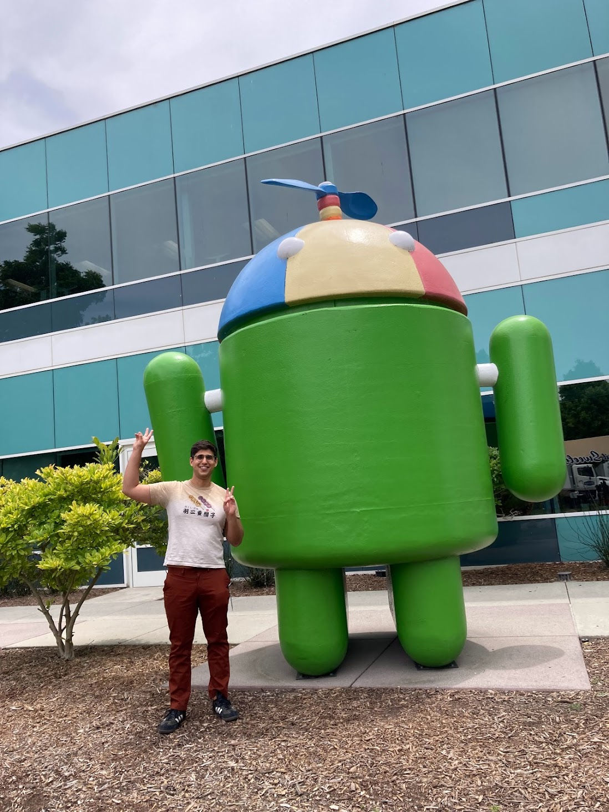

>### tl;dr
> * 

## Interning at Google: first reflection

Tomorrow will be my fourth week since I’ve started working at Google for my summer internship. I’ll describe some of my experience, how I got here, and finally what I’ve learned so far. This article will likely be article 1 of a series of three going from beginning to end. This is the beginning to my reflection on the experience.

### Describing what it's like to work at Google
There is a lot of speculation of what it is like to work for a big tech company, or so-called FANG/MAMA companies (Meta, Alphabet, Microsoft, and Apple). I will take this opportunity to give my own opinion on what it is like to work in the industry here.

I am not traditionally from the tech industry. I focused my professional career in the logistics industry and kind of found myself more and more interested in architecting and planning software. Give my [LinkedIn](https://www.linkedin.com/in/diazjalejandro/) a glance. I try to keep it as a living record as I climb the metaphorical mountain of career growth in America.

{: height="550" }

I can confirm that a lot of the hype of working in big tech is warranted. Free food, laundry, gyms, message chairs – it’s all there. However, I 100% tell you right now every amenity is earned. Software is HARD and it is a grind. Engineers earn a respectful living, but it is in no way handed to you.

Imposter syndrome, burnout, having meetings from AM to PM are, unfortunately, all too real in the industry.

I was surprised and taken aback a little by my colleagues. I’ve been here for such a short time, but the climate and openness of team members is already self-evident. People who get here are bright, hard-working, and take joy in teaching and helping others. I found this to be true when I ask questions, but also witnessed it observing Nooglers ask for help. 

> “Here, it’s not like other companies where you have to earn everyone’s trust. It’s kind of like you start off with that trust and have to work to lose it.” 

Unlike other jobs where I felt an unspoken pressure in the office, here there is a sense of freedom I’ve never experienced while working.

### How did I get here?
I met up with some 20 other interns for lunch at one of the larger cafes on the Sunnyvale campus. Introductions were passed around. After 5 or so people it seemed like everyone was a student at Yale, Carnegie, Columbia, Harvard, or some other variation. My home page kind of describes my background, but to give a quick run-down, I grew up in the hood (airport/east point are of Atlanta). In combination with comparing myself to others, I quickly got into a fight with imposter syndrome. I am growing to be more confident as I do more and more work in Google’s C++ backend, but the feeling of being an outsider can still linger. 

I can best describe imposter syndrome with an allegory. There’s a scene in Parasite where the protagonist is wondering if he can fit into with the wealthy class that has adopted him into the fold. He questions his love interest if he belongs there, in the family’s beautiful home while a party goers merry outside.

{: height="550" }

The scene is a great metaphor for imposter syndrome. 

The protagonist that has tricked his way into being associated with wealth, and now reflects on his place in the world. The wealthy family separated from him by the sheet of glass and his love interest, the anchor that has given him this window into this life, separated by a subtle line in the glass. While our lives are likely far from similar, the feelings this scene evoke speaks to me.

Working with people with these amazing backgrounds solidified to me that they’re smart, but I shouldn’t automatically conclude that I’m (or anyone else) is not on the same playing field. On the contrary, it has allowed me to realize the only thing those schools and background does is give you some innate confidence or at least make others perceive you as smarter/more confident.

The one lesson life has taught me, as corny as it sounds, is to be persistent. I failed to get into my master’s program the first time. I applied to about 200 jobs right out of college and only got into 1. Over and over again life has a way of putting your face in the dirt. But refusing to give up is a superpower.

### What have I learned so far?
There’s a couple of key lessons so far in this internship: avoid getting complicit and never stop growing, know when to go and ask for help, communicate, and advocate for yourself, and most importantly, don’t be afraid to fail.

There’s an art to failing, especially in software engineering. The key is to try and try again, iterating on your approach until you are making no progress. Once you reach this point you know it’s time to ask colleagues for input to solve the problem. 

The key to this process is short, feedback loops, where you fail often and quickly and learn from it. Failing just for the sake of failing is, well, failing. If you find places to make changes and get new error codes, well it’s fantastic news.

Just like you.

See you next time, space cowboy. 
