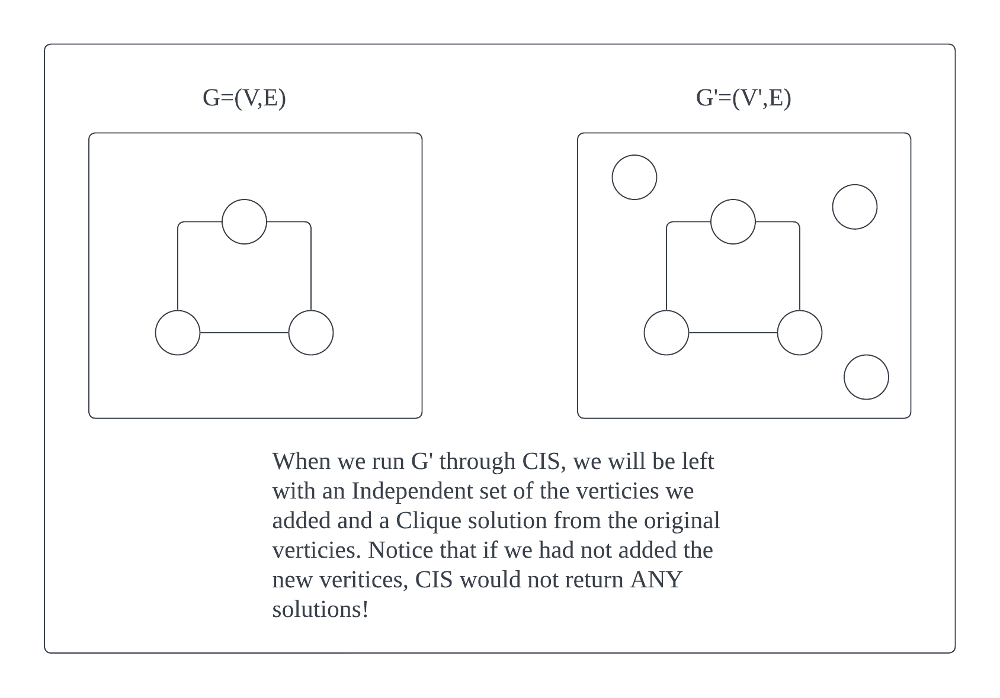

## Overview

**Problem Statement**
> Prove that the following problem is NP-complete: given an undirected graph $G = (V, E)$ and an integer $k$, return a clique of size $k$ as well as an independent set of size $k$, provided both exist.

**Approach**

We call the problem CIS for brevity.

First, we show that the problem is in the NP computational class. 
Next, we show we can reduce the known NP-complete problem Clique $\rightarrow$ CIS.
Finally, we provide a bidirectional proof to prove that the reduction is correct, which also proves that $CIS\in NP$-complete.

### CIS in NP
We need to show that for any solution $S$ for and instance $I$ of CIS can be verified in polynomial time. 

* To validate the $S$ clique, we first check that there are not more than $k$ vertices in $S$. This takes $O(n)$ time.
* Next, we check that all pairs are strongly connected (to satisfy the definition of a clique). We do this by looking at each $x,y$ vertex and ensuring there is an edge between them. This takes $O(n^2)$ time.

The above is poly-time to the input, thus we can assert $CIS\in NP$.

### CIS in NP-complete

#### Clique -> CIS
We now reduce a known NP-complete problem, Clique, to CIS. We must take care of the wording of the problem: it will only return IFF there is both a clique and an independent set of size $k$.

Clique takes a graph, $G=(V,E)$ and a goal $g$.

We can take the $G$ and modify it. We add vertices to the graph which are not connected to any edges, such that there are $g$ new vertices, for a total of $|V'|=|V|+g$.	

Now we pass $G'$ (the transformed graph) and $g$ to CIS. If there is a clique of size $g$, CIS will return that clique as well as an independent set of size $g$ (which we guaranteed by the above). Our illustration captures what's going on.

The transformation is poly-time, taking at most O(n+m) to add vertices to the graph.

{: height="550" }

#### Clique <==> CIS
Now we have to prove correctness. We do this by proving both directions. That is $Clique\iff CIS$:

* Show that if CIS has a solution, then Clique has a solution: CIS returns the clique of size $g$ and an independent set of size $g$ if both exist. We have guaranteed a independent set of size $g$ by the above construction, therefore CIS will only return if there is a valid clique in $G$, which is also the solution for Clique (since both demand a goal of the same size $g$).
* Show that if Clique has a solution, then CIS has a solution: Clique will only have a solution if $G$ has a clique of at least size $g$. But by construction, we've also added an independent set to $G'$, which means that CIS is also guaranteed a solution.

Thus $CIS\in NP$-complete by reduction. $\square$